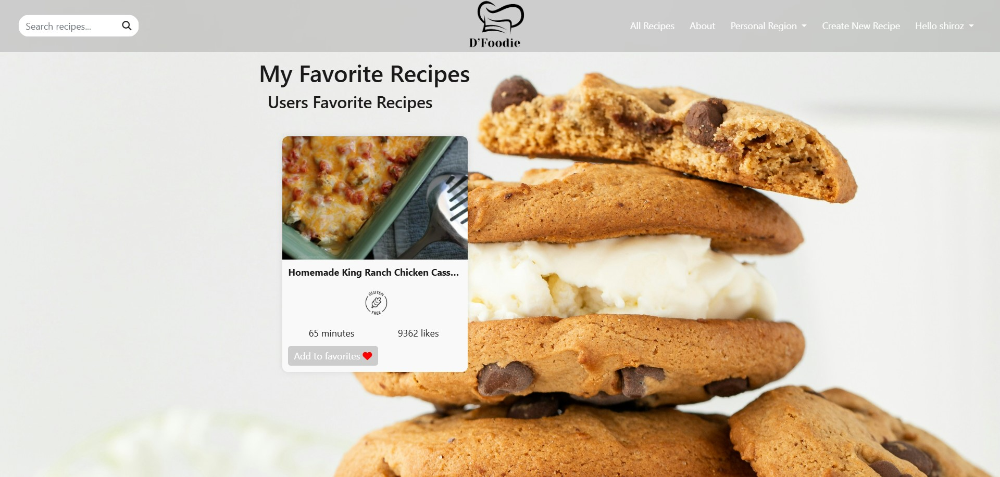

# **D'Foodie Project**

D'Foodie is a full-stack recipe-sharing web application developed using **Vue.js** for the client-side and a **Node.js** server with RESTful APIs. The application integrates the **Spoonacular API** for recipe search, caching, and user-specific features like favorites and custom recipes.

---

## **Features**

### 🧾 **General Features**
- **Recipe Search**: Search recipes by name, cuisine, diet preferences, and intolerances.
- **Recipe Details**: View detailed information about each recipe, including preparation time, ingredients, and more.
- **Random Recipes**: Retrieve 3 random recipes for inspiration.
- **Authentication**: Secure user registration, login, and logout with password hashing and sessions.
- **Caching**: Optimized performance with caching mechanisms for recipe data.

### 👤 **User-Specific Features**
- **Favorites**: Users can add recipes to their favorites list.
- **Custom Recipes**: Logged-in users can create, manage, and view their own recipes.
- **Last Viewed Recipes**: Track and display the last 3 recipes viewed by the user.

---

## **Tech Stack**

### **Frontend**
- **Vue.js**: Client-side rendering and dynamic UI components.
- **Vue Router**: Routing for navigation between pages.
- **Vuex** (optional state management): Used for shared data like the server domain.
- **Bootstrap Vue**: Styling and layout.

### **Backend**
- **Node.js with Express**: RESTful APIs for handling HTTP requests.
- **Spoonacular API**: Integrated for recipe data.
- **MySQL**: Database for user accounts, favorites, and custom recipes.
- **Sessions & Authentication**: Cookies with bcrypt for secure login and session management.

---

## **Installation**

### **Backend Setup**
1. **Clone the repository**:
   ```bash
   git clone https://github.com/<your-username>/dfoodie.git
   cd dfoodie
   ```

2. **Install backend dependencies**:
   ```bash
   cd server
   npm install
   ```

3. **Set up the environment**:
   - Create a `.env` file in the `server` directory:
     ```bash
     PORT=3000
     bcrypt_saltRounds=12
     session_secret=your_secret
     ```

4. **Configure MySQL**:
   - Set up the MySQL database and import the required schema (tables for `users`, `favorites`, etc.).

5. **Start the server**:
   ```bash
   node server.js
   ```

### **Frontend Setup**
1. **Install frontend dependencies**:
   ```bash
   cd client
   npm install
   ```

2. **Run the client**:
   ```bash
   npm run serve
   ```

---

## **Frontend Logic**

### **Main Files**
1. `main.js`:
   - Configures the Vue app, router, and Axios interceptors for API requests.
   - Shares global data like user session and server domain via `shared_data`.

2. `App.vue`:
   - Acts as the root component, handling layout and navigation across the app.

3. `routes.js`:
   - Defines routes for the app, including:
     - `"/"`: Main page.
     - `"/register"`: User registration.
     - `"/login"`: User login.
     - `"/search"`: Recipe search.
     - `"/recipeViewPage"`: Recipe details.
     - `"/my-recipes"`: User-created recipes.
     - `"/favorite-recipes"`: User favorite recipes.

4. `store.js`:
   - Contains shared state for the frontend, including the server domain.

---

## **API Endpoints**

### **Authentication**
| Method | Endpoint       | Description           |
|--------|----------------|-----------------------|
| POST   | `/auth/Register` | Register a new user   |
| POST   | `/auth/Login`    | User login            |
| POST   | `/auth/Logout`   | User logout           |

### **Recipes**
| Method | Endpoint                    | Description                          |
|--------|-----------------------------|--------------------------------------|
| GET    | `/recipes/search`           | Search recipes                       |
| GET    | `/recipes/preview/:recipeId`| Preview recipe details               |
| GET    | `/recipes/fullview/:recipeId`| Full recipe details                  |
| GET    | `/recipes/random`           | Retrieve 3 random recipes            |

### **User-Specific**
| Method | Endpoint            | Description                          |
|--------|---------------------|--------------------------------------|
| POST   | `/users/favorites`  | Add recipe to favorites              |
| GET    | `/users/favorites`  | Get all favorite recipes             |
| POST   | `/users/createRecipes` | Create a custom recipe             |
| GET    | `/users/myRecipes`  | View all user-created recipes        |
| GET    | `/users/lastViewed` | View last 3 viewed recipes           |

---

## **Main Screenshots**

1.  **User Homepage**
    
2.  **Add to Favorites**
   
3. **Favorites Page**
   
4. **Creatr User Recipe**
   
5. **User Recipes Page**
   
6. **Recipe Full View**
   
7. **Search Engine**
   

